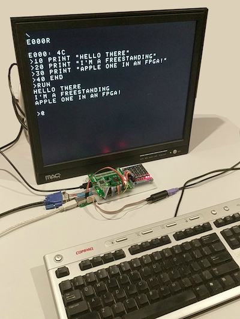

This is a basic implementation of the original Apple 1 in Verilog. It can run the Apple 1 WozMon and Integer Basic via the serial or VGA 640x480 video with PS/2 keyboard standalone. This makes this a very compact little set up. So far fully tested and supported boards are:
- [iCE40HX8K-B-EVN breakout](http://www.latticesemi.com/Products/DevelopmentBoardsAndKits/iCE40HX8KBreakoutBoard.aspx)
- [Terasic DE0](http://www.terasic.com.tw/cgi-bin/page/archive.pl?Language=English&No=364)
- [Digilent Spartan-3E Starter Board](https://store.digilentinc.com/spartan-3e-starter-board-limited-time/)

Contributor supported boards (YMMV):
- [Blackice II](https://www.tindie.com/products/Folknology/blackice-ii/)
- [icoBoard](http://icoboard.org/)
- [Olimex iCE40HX8K with ICE40-IO](https://www.olimex.com/Products/FPGA/iCE40/iCE40HX8K-EVB/open-source-hardware)
- [TinyFPGA B2](http://tinyfpga.com/)
- [Upduino](http://gnarlygrey.atspace.cc/development-platform.html)

<p align="center">
 
</p>

This project borrows heavily from the *awesome* work of Andrew Holme and his ["Pool"](http://www.aholme.co.uk/6502/Main.htm) project and [Arlet Otten's](https://github.com/Arlet/verilog-6502) tiny 6502 core. Also many special thanks to ["sbprojects.com"](https://www.sbprojects.com/projects/apple1/index.php) for the wealth of information I gleaned from there.

## Memory Map
 
The memory map is currently set up to have:

 Start | End | Description
 ----- | --- | -----------
 0x0000 | 0x1FFF | 8KB of block RAM for system
 0xE000 | 0xEFFF | 4KB of block RAM for basic ROM
 0xFF00 | 0xFFFF | 256B of block RAM for WozMon ROM

You can swap out the Basic ROM to get more RAM if you need the space, this can be achieved easily with only minor modifications to the top file.
 
## Building

Each supported board has a directory in `boards`. This directory has a structure where each board can have multiple build environments (eg. yosys, icecube2, quartus etc).

Each board has specific instructions that will explain further the requirements of each board and how to build for it, but basically all should support the following.

To build for your board you just need to open the project or use the `Makefile` that's compatible with your board.

eg.
```
$ cd boards/ice40hx8k-b-evn/yosys/
$ make
```

### Board READMEs
- [iCE40HX8K-B-EVN breakout](boards/ice40hx8k-b-evn/README.md)
- [Terasic DE0](boards/terasic_de0/README.md)
- [Digilent Spartan-3E Starter Board](boards/spartan3e_starterkit/README.md)
- [Blackice II](boards/blackice2/README.md)
- [Olimex iCE40HX8K with ICE40-IO](boards/olimex_ice40hx8k_evb_ice40-io/README.md)
- [TinyFPGA B2](boards/tinyfpga_b2/README.md)
- [Upduino](boards/upduino/README.md)

## The BACKSPACE key and how to delete typos

The Apple 1 didn't have a typical "backspace" key as we are use to today, due to the way the video display worked it couldn't move the cursor backward to erase characters. So instead it used a "rubout" character, which is the underscore character (_). This character signifies that the input buffer has been moved backwards one character (eg. `PRN_INT` would be received by the Apple 1 as `PRINT`).

It takes a little getting used to but you'll soon get the hang of it.

## The Apple 1 only understands UPPERCASE characters

If you're using the PS/2 input you don't need to be worried about this, as we automatically UPPERCASE all typed characters so WozMon can understand what you are typing.

However if you are using the UART and a serial terminal you will need to remember to turn on your CAPSLOCK, otherwise nothing will respond as you might expect.

## Serial Setup
 
Depending on the board you can use serial to communicate with the Apple 1, some boards require a toggle to be set to select between PS/2 input and UART input. The UART by default will be set to 115200 (8/N/1).
 
A very basic hardware flow control is implemented. You should turn on CTS support as this will allow you to cut and paste code into the Woz Mon without the Apple 1 missing any bytes.

 
## VGA / PS/2 Setup
 
Most boards support PS/2 input and VGA output. This is the most support method, however all output is replicated to the UART (if available) and the PS/2 keyboard input can be replaced with the UART out if the "toggle" mode buttons is selected.

Unlike the original Apple 1 this implementation can (depending on board you are using and it's support) change the foreground and background colours of the VGA output, as well as differnet scanline modes for the font.
These controls are mapped to memory locations you can tweak using WozMon and are reset back to defaults when the system is reset.

 | Register | Function | Value | Description |
 | --- | --- | --- | --- |
 | 0xC000 | Font | 00 | Default
 | | | 01 | Vertical scanlines
 | | | 02 | Horizontal scanlines
 | | | 03 | Dot mode
 | 0xC001 | Foreground | 00 | Black
 | | | 01 | Blue
 | | | 02 | Green
 | | | 03 | Cyan
 | | | 04 | Red
 | | | 05 | Magenta
 | | | 06 | Yellow
 | | | 07 | White
 | 0xC002 | Background | 00 | Black
 | | | 01 | Blue
 | | | 02 | Green
 | | | 03 | Cyan
 | | | 04 | Red
 | | | 05 | Magenta
 | | | 06 | Yellow
 | | | 07 | White
 
## Helping
 
All PRs and suggestions happily accepted! Please any support us most welcome, and it would be good to have this as feature complete as possible with the real Apple1. I'd like to implement the cassette interface next with the basic electronics to talk to the headphone/mic jack of a mobile phone to upload and download recordings as a means to save programs.
 
But yes, help happily accepted!
