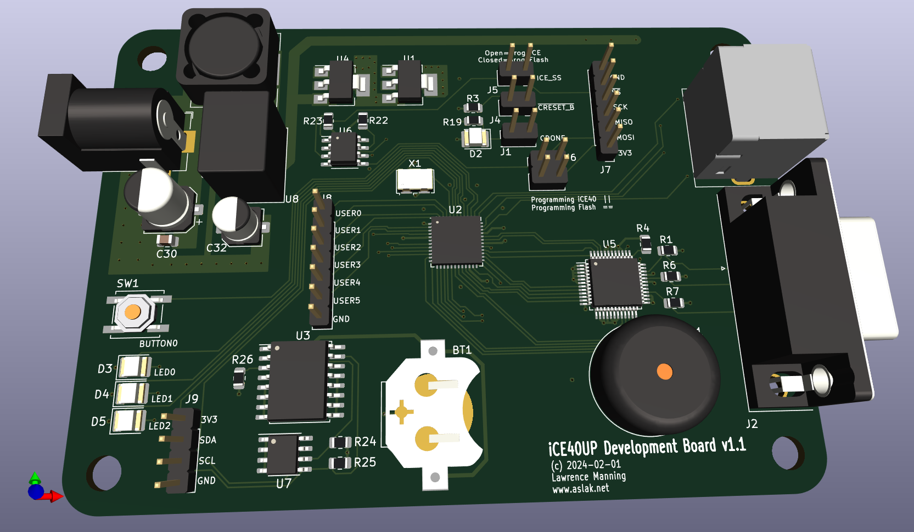

# ICE40UPDev Board support



This adds support for building apple one design for [Aslak3's ICE40UP Development Board](http://github.com/aslak3/ICE40UPDevBoard). The board contains a [ADV7123](https://www.analog.com/media/en/technical-documentation/data-sheets/ADV7123-EP.pdf) (PDF) RGB DAC and PS/2 port, and some I2C hardware that this Apple 1 implementation does not yet make use of. The single push button on the board is mapped to the reset line. The PS/2 port on the board is actually wired to two PS/2 connections, but this project makes only use of the first ("default") wiring for the keyboard.

## Building
Install a recent toolchain and:

```
$ cd yosys
$ make
```

Unlike other boards in this project nextpnr-ice4 is used for routing, since it has been the current tool for some years now and arachne-pnr was deprecated in 2015.

Program the board using any suitable method.
