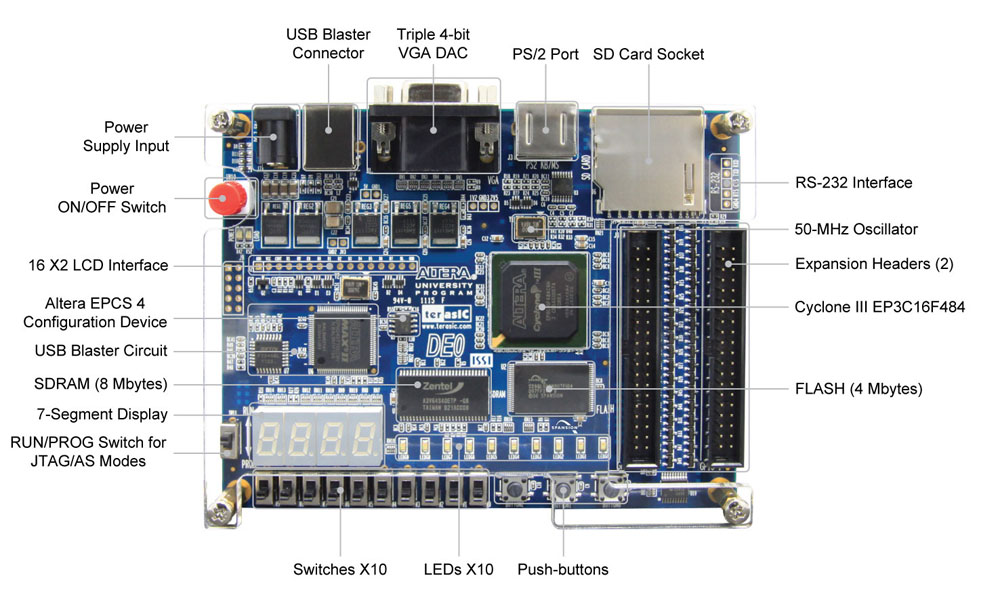

# Apple One Terasic DE0 Board target

Maintainer: Niels Moseley https://github.com/trcwm

### Build environment
The project was developed using Quartus II 13.1. Using other versions might work, YMMV.

### Features
* UART support via the on-board RS-232 interface.
* VGA support via the on-board VGA connector.
* PS/2 keyboard support via the on-board PS/2 connector.
* The 7-segment display shows the 6502's program counter.
* The right-most push button resets the system.
