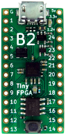

# TinyFPGA B2 support



This adds support for building apple one design for [TinyFPGA B2 board](http://tinyfpga.com/b-series-guide.html) on [TinyFPGA Computer Project Board](https://hackaday.io/project/29526-tinyfpga-computer-project-board) used for VGA and PS2

## Building
Install a recent IceStorm toolchain, and:

```
$ cd yosys
$ make
```

Since programming here is done with custom tool it is important to have tinyfpgab installed.
