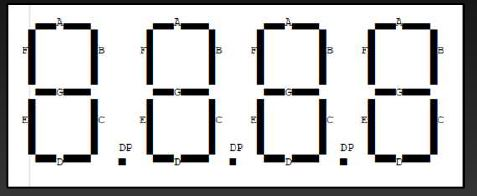
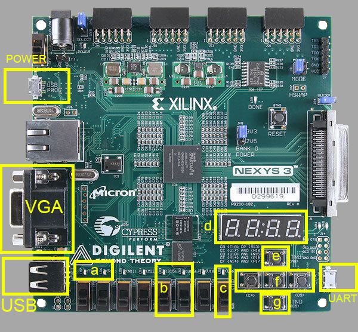

## What´s updated?

I have updated some files:

- ram.v -> Adding the "loader" or "cassette loader" based on a predefined order of programs in "/progs_apple/programs.HEX"
- PS/2 and USB keyboard use the same codification, and worked
- Code to use board's display in"display.v"
- Code to make a "circular array" for 10 programs (from 0 to 9) and show in the display

## Why I made this update?

Basically it my Final Proyect for Computer Science Degree in ETSISI,UPM,Madrid,Spain

Also, the are some things as the loader or the USB keyboard, and it's nice to add some of them

## How works the display?

It's made of 4 digit of 7 segments each, so 32 bits for correct display of each "acronim of a program"

With a circular array, you can shift both ways, and could load on memory with a button.

###### More Easy!

## Which programs can work?

In the folder "/progs_apple/" you have a file "programs.hex", Its used to combine all codes in an unique file. 
Verilog and Xilinx ISE are a bit "delicated" using various files to the same job.

Additionally, in the folder "/progs_apple/Hex/" there are all the Hex or ".bin" files. All tested in this project and working. The order used is the next:
Due to some 'not-availability' of some 7 segments characters, I used similiars 'graphically'.
         
         Block 0 of 3 Block Memory
              0.nUL : Program "Null", erases all the RAM. No execution
              1.A30 : Program "Apple 30th", Apple I's Graphic Demo. Executes with 280R
              2.hEL : Program "Hello World", as the name indicates, print a "Hello World!". Executes with 280R
              3.LUn : Program "Lunar Lander", land a Lunar Module on the Moon. Executes with 300R
              4.HEH : Program "Memory Test", test the first addreses of the memory (h00-hFF). Executes with 280R and requires execute "01: 05 0 10" before execution
              5.uCh : Program "MicroChess", working microchess of the Apple I. Executes with 1000R
              6.PAS : Program "Pasart", Don't know the meaning, something about "Matrix Art". Executes with 300R
              7.St1 : Program #1 "Star Trek", Text adventure from Star Trek. Load "pre-280" addresses.
              8.St2 : Program #2 "Star Trek", Text adventure from Star Trek. Load "post-280" addresses. Executes with BASIC (>E2B3R)
              9.Lto : Program "Little Tower", Text adventure in a tower. Not work propperly despite the same code as original (memory perhaps). Executes with 300R
 
         Block 1 of 3 Block Memory
              0.bJ1 : Program #1 "BlackJack", BlackJack or 21 game. Load "pre-280" addresses.
              1.bJ2 : Program #2 "BlackJack", BlackJack or 21 game. Load "post-280" addresses. Executes with BASIC (>E2B3R)
              2.Ck1 : Program #1 "Checkers", Checkers game, more visual than Chess. Load "pre-280" addresses.
              3.Ck2 : Program #2 "Checkers", Checkers game, more visual than Chess. Load "post-280" addresses. Executes with BASIC (>E2B3R)
              4.hA1 : Program #1 "Hamurabi", Hamurabi game about strategy. Load "pre-280" addresses.
              5.hA2 : Program #2 "Hamurabi", Hamurabi game about strategy. Load "post-280" addresses. Executes with BASIC (>E2B3R)
              6.Ht1 : Program #1 "Matrix", Visual Effect similar to the movie Matrix, characters "falling" on screen. Load "pre-280" addresses.
              7.Ht2 : Program #2 "Matrix", Visual Effect similar to the movie Matrix, characters "falling" on screen. Load "post-280" addresses. Executes with BASIC (>E2B3R)
              8.SL1 : Program #1 "Slots", Slots game. Load "pre-280" addresses.
              9.SL2 : Program #2 "Slots", Slots game. Load "post-280" addresses. Executes with BASIC (>E2B3R)
              
         Block 2 of 3 Block Memory
              0.Hon : Program "Monitor", A better version of Wozmon, with some addings as a calculator. Executes with F3DR
              1.HP1 : Program #1 "Wumpus", Hunt the Wumpus' game. Load "pre-280" addresses. 
              2.HP2 : Program #2 "Wumpus", Hunt the Wumpus' game. Load "post-280" addresses. Executes with BASIC (>E2B3R)
              3-9: Blank, for new programs.
              
         Block 3 of 3 Block Memory
              0-9: Blank, for new programs.
              
## Use of the board

- **a**: LEDs indicating the state of the load
- **b**: Switch to change the Program Memory Block
- **c**: Alternate USB keboard and UART text input
- **d**: Display
- **e**: Restart Apple I button
- **f**: Control buttons for the display
- **g**: Clean VGA screen

## Additional Comments

I´m satisfied with this project and thanks for any support or gratitude.
